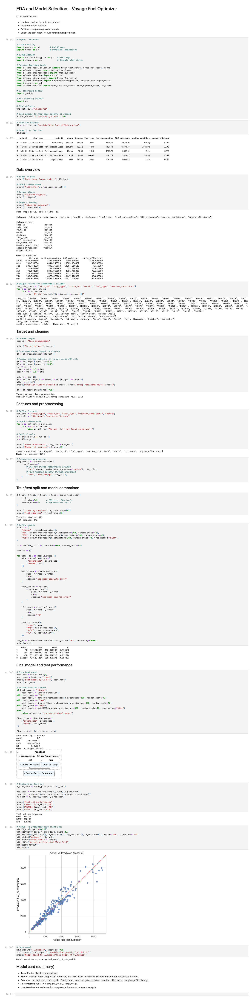
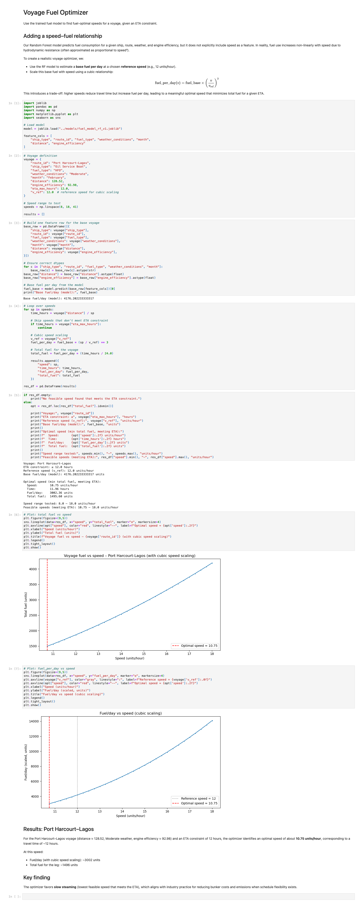

# Voyage Fuel Optimizer

Predicting and optimizing ship fuel consumption for Nigerian waterways using machine learning and simple voyage optimization.

## Overview

This project builds a data-driven fuel consumption model and uses it to find fuel-optimal speeds for given voyage scenarios (route, weather, engine efficiency, ETA constraint).

Key components:
- **Data:** Ship fuel consumption dataset for Nigerian waterways (`data/ship_fuel_efficiency.csv`).
- **Model:** Random Forest Regressor predicting `fuel_consumption` from ship/route/weather/engine features.
- **Optimizer:** Simple voyage optimizer that trades off speed, time, and fuel using a cubic speed–fuel relationship.

## Repository structure

- `data/` – Raw data (e.g., `ship_fuel_efficiency.csv`).
- `notebooks/` – Analysis and modeling notebooks.
  - `01_eda_and_model_selection.ipynb` – EDA, preprocessing, model comparison, final model.
  - `02_voyage_optimizer.ipynb` – Voyage optimization with speed–fuel scaling.
- `models/` – Trained model artifacts (e.g., `fuel_model_rf_v1.joblib`).
- `src/` – Helper modules (optional).
- `app/` – Streamlit app (optional, Phase 2).

## Quick start

1. Clone the repo:
   ```bash
   git clone git@github.com:midhunrajds/voyage-fuel-optimizer.git
   cd voyage-fuel-optimizer
   ```

2. Create a virtual environment and install dependencies:
   ```bash
   python -m venv venv
   source venv/bin/activate
   pip install -r requirements.txt
   ```

3. Open the notebooks:
   ```bash
   jupyter notebook
   ```
   Then open:
   - `notebooks/01_eda_and_model_selection.ipynb`
   - `notebooks/02_voyage_optimizer.ipynb`

## Model summary

**Task:** Predict ship fuel consumption per voyage record.

**Model:** Random Forest Regressor (300 trees) in a scikit-learn pipeline with:
- OneHotEncoder for categorical features: `ship_type`, `route_id`, `fuel_type`, `weather_conditions`, `month`
- Numeric features: `distance`, `engine_efficiency`

**Target:** `fuel_consumption`

**Performance (5-fold CV on training data):**
- R² ≈ 0.93
- MAE ≈ 342 liters
- RMSE ≈ 461 liters

**Interpretation:** The model explains ~93% of the variance in fuel consumption, with an average absolute error of ~342 liters. This provides a strong baseline for scenario analysis and voyage optimization.

## Voyage optimization

Using the fuel model plus a cubic speed–fuel scaling:

$$
\text{fuel\_per\_day}(v) = \text{fuel\_base} \times \left(\frac{v}{v_{\text{ref}}}\right)^3
$$

the optimizer finds the speed that minimizes total fuel for a given route and ETA constraint.

**Example result (Port Harcourt–Lagos, ETA ≤ 12h):**
- Optimal speed: ~10.75 knots
- Travel time: ~12 hours
- Total fuel: ~1496 liters

The optimizer typically favors **slow steaming** (lowest feasible speed that meets the ETA), which aligns with industry practice for reducing bunker costs and emissions.

## How to run the optimizer

Open `notebooks/02_voyage_optimizer.ipynb` and follow the cells. The notebook:
- Loads the trained model from `models/fuel_model_rf_v1.joblib`.
- Defines a voyage (route, distance, weather, engine efficiency, ETA).
- Searches over speeds, applies cubic scaling, and selects the fuel-optimal speed.
- Plots fuel vs speed curves.

## Next steps / extensions

Possible extensions:
- Add more routes and weather scenarios.
- Build a CO₂-focused optimizer using `CO2_emissions`.
- Wrap the optimizer in a Streamlit app for interactive exploration.
- Incorporate real AIS-based routes and marine weather data.

## License

MIT.

## About

This project was developed as an independent data science project to showcase end-to-end skills: data cleaning, EDA, modeling, and a simple optimization application in the marine/shipping domain.

**Interactive demo:** [Voyage Fuel Optimizer (Streamlit)](https://voyage-fuel-optimizer-abjnte8lhjkkua6ebpaxle.streamlit.app/)


## How to use the app

Open the live demo:  
[Voyage Fuel Optimizer (Streamlit)](https://voyage-fuel-optimizer-abjnte8lhjkkua6ebpaxle.streamlit.app/)

1. In the left sidebar, set your voyage inputs:
   - Ship type, fuel type, and route (e.g., “Port Harcourt–Lagos”)
   - Weather conditions and month
   - Distance (nautical miles) and engine efficiency
   - Maximum travel time (ETA, in hours)
2. The app computes fuel consumption over a range of feasible speeds and applies cubic speed–fuel scaling.
3. Review the results:
   - Optimal speed, travel time, fuel/day, and total fuel
   - “Total fuel vs speed” and “Fuel/day vs speed” plots
   - A sample table with computed values for each candidate speed

Use the app to explore how route, weather, engine efficiency, and ETA constraints affect the fuel-optimal speed.

## Notebook previews

### 01 EDA and model selection



### 02 Voyage optimizer


